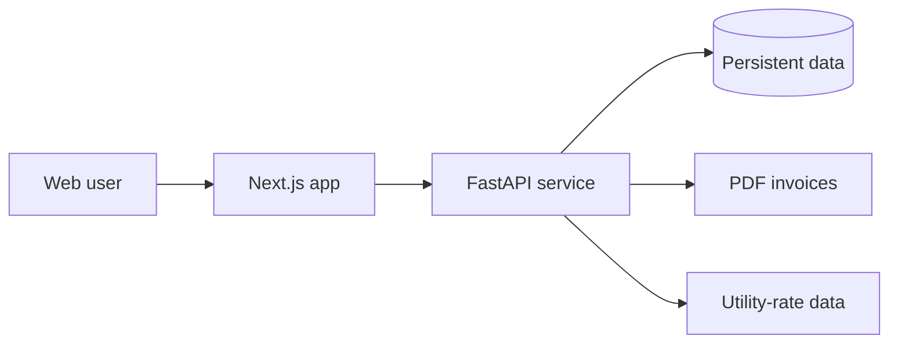

# SolarShare

Award-winning clean-energy decision platform built with Next.js and FastAPI.

**First Prize — 2025 PSEG Long Island Innovation Challenge**

[Live web app](https://solarshare-web.vercel.app) · [API health](https://solarshare-api.onrender.com/health) · [Deployment guide](./DEPLOY_RENDER.md)

SolarShare helps households explore solar options, estimate value, organize customer and billing workflows, and move from interest to an informed next step. The repository demonstrates a production-shaped full-stack system rather than a single landing page.

## Engineering proof

| Area | Implementation |
| --- | --- |
| Frontend | Next.js 15, React 19, TypeScript, Tailwind CSS, Framer Motion |
| Backend | FastAPI with typed validation and modular API routes |
| Security | JWT authentication, roles, rate limiting, and idempotency controls |
| Business workflows | Analytics, billing, CRM, contacts, utility rates, and PDF invoices |
| Persistence | Configurable persistent stores for application data |
| Quality | Pytest logic/API coverage plus frontend production builds |
| Delivery | Vercel frontend and Render API |

## Product capabilities

- Solar opportunity and utility-rate workflows
- Authentication and role-aware access
- Customer, contact, CRM, and billing operations
- Analytics and decision-support views
- PDF invoice generation
- Assistant workflow for guided product interaction
- API safeguards for rate limits and repeat requests

## Architecture



## Repository map

```text
SolarShare/
├── backend/          FastAPI routes, services, persistence, and tests
├── frontend/         Next.js application
├── DEPLOY_RENDER.md  Deployment and environment guidance
└── README.md         Product and engineering overview
```

## Run locally

### Backend

```bash
cd backend
python -m venv .venv
source .venv/bin/activate        # Windows: .venv\Scripts\activate
pip install -r requirements.txt
uvicorn main:app --reload
```

### Frontend

```bash
cd frontend
npm install
npm run dev
```

Point the frontend API configuration at the local FastAPI service. See `DEPLOY_RENDER.md` for deployment-specific variables.

## Test and verify

```bash
cd backend && pytest
cd frontend && npm run build
```

## Scope and limitations

SolarShare is a portfolio and competition project. Estimates and utility-rate data should be independently validated before anyone makes a financial or installation decision. A production launch would also require jurisdiction-specific compliance, monitored integrations, security review, and audited billing behavior.

## Recognition

SolarShare received first prize at the 2025 PSEG Long Island Innovation Challenge at Farmingdale State College.

## Author

Built by [Muhammad Imran](https://github.com/Muhammad7839) — [portfolio](https://muhammad7839.github.io/portfolio) · [LinkedIn](https://www.linkedin.com/in/muhammadimran-swe/)
